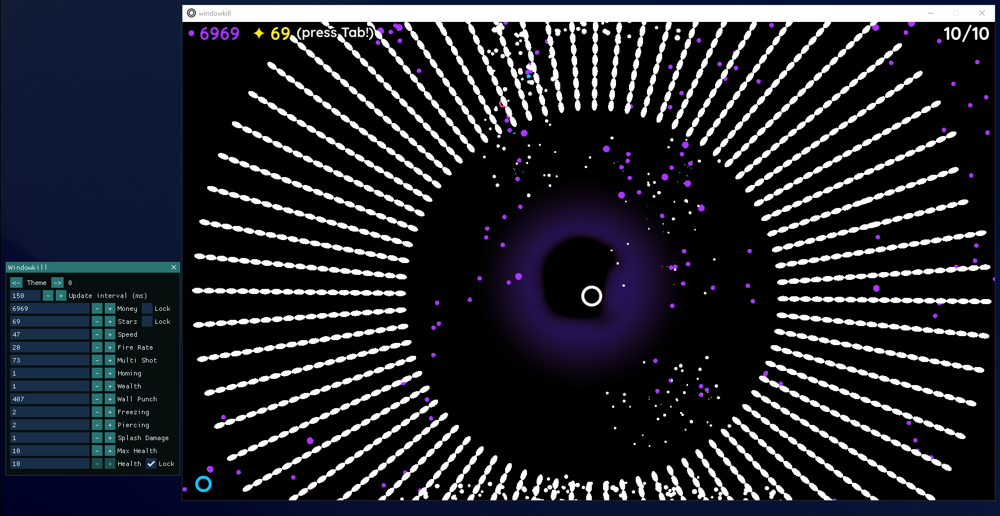
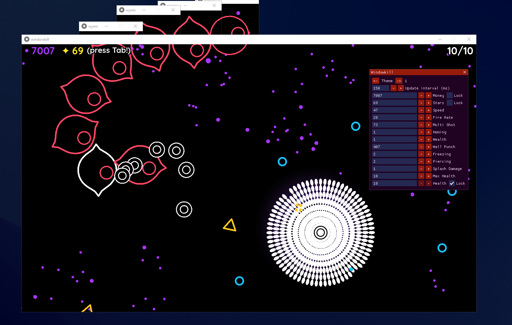
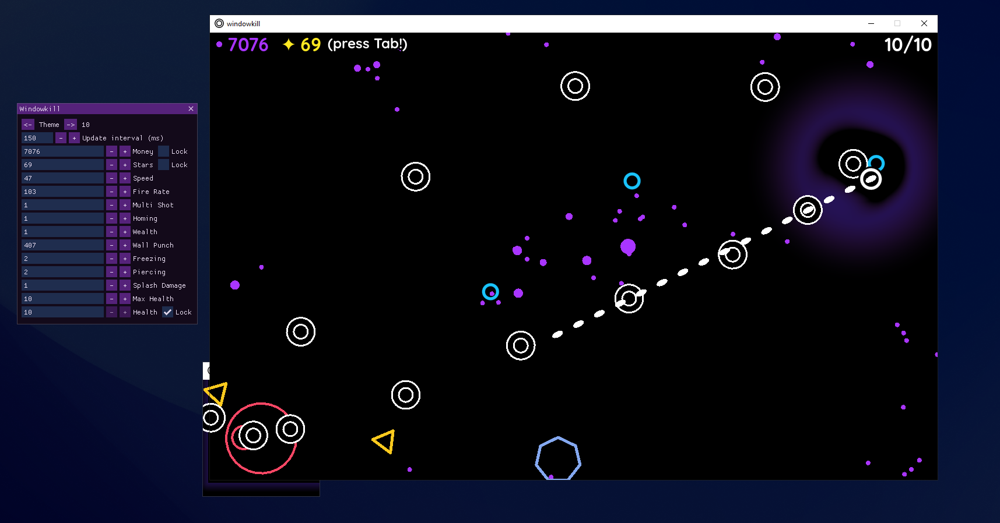
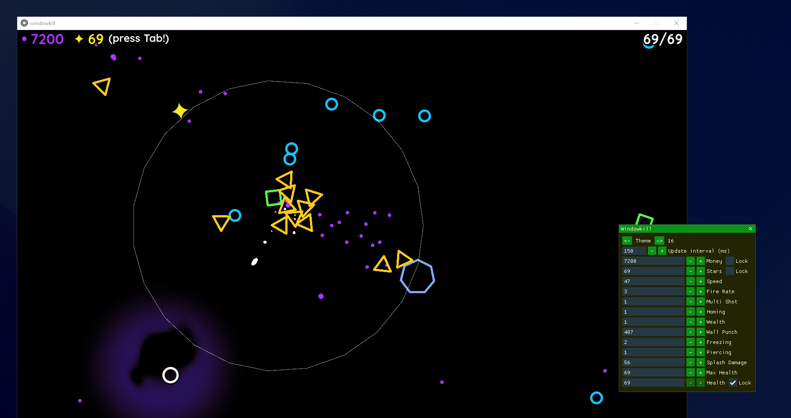

<h1 align="center">WK-ImGui_External</h1>

An external cheat/memory modifier for the game <strong>WindowKill</strong> using Dear ImGui.

Currently supports only version <strong>2.0.3b</strong> as I don't have access to the paid version <strong>v3.2.1</strong> :(

You can download <strong>v4</strong> from the <a href="https://github.com/fakepepsilol/WK-ImGui_External/releases">Releases</a> page.

 
 

 
 

 
 

 
 

